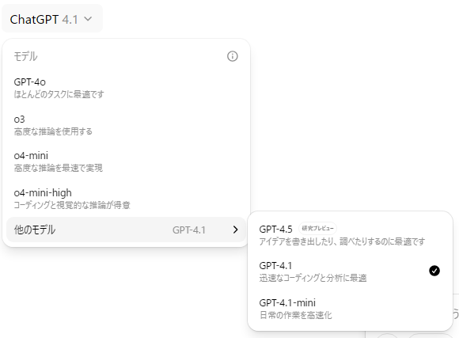

import Callout from '@/components/Callout.astro'
import Tweet from '@/components/Tweet.astro'
import { Icon } from 'astro-icon/components'

Xを眺めていたらこのツイートが流れてきた。

<Tweet id="1922707554745909391" />

これまでGPT-4.1はChatGPTのWeb / アプリともに未提供で、Playground上のみでの提供だった。常にサブモニター上にChatGPTを開いている人間としては非常に有り難い。

発表から約2時間後の現時点で既に利用可能になっていたので、色々触ってみる朝。

