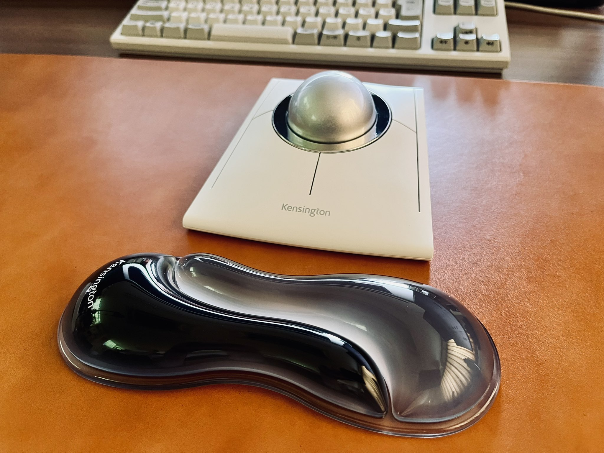

import Tweet from '@/components/Tweet.astro'

## 2025年7月現在のデスク環境

先月より新しいガジェット（ここでは、あえてガジェットと呼ぶ）をいくつか導入し、個人的な癖に刺さるデスク環境が出来たのでその紹介をしたいと思う。

## レザーデスクマット

アップデート欲の起こりとなったのは、間違いなくこのデスクマットだ。

そもそも、これまでは趣味でゲームをプレイしていたこともあって、長年ゲーミングマウスパッド一筋だった。しかし最近になって急なゲーム欲の低下とマウスパッドの劣化をきっかけとして、デスクマットに興味を持った。

界隈でまず候補となるであろうフェルトデスクマットやキーボード+マウスの領域を網羅出来る大きなマウスパッドは、どれも好みとは程遠く悩ましかった。そこで、レザーである。個人的にレザーの経年変化が好きで自分の持ち物はもちろん、友人家族に贈るプレゼントにもレザーを選ぶ程度にはレザーが好きだった。

様々なブランドの既製品、メーカーのオーダーメイドを検討したが中々自分の環境のサイズに合うものが見つからない。

そんな中で、神戸にある [工房壱さん](https://studio-ichi.com) が過去のオーダーメイド事例として公開していたレザーデスクマットを見つけ、まさしく一目惚れ。すぐにメールを送り、サイズや革の色の相談をした。結果が上にある通り、この作業環境にピッタリとハマる完璧なデスクマットである。大切に使っていくのはもちろん、経年変化が楽しみな逸品である。気になった人はぜひ相談してみてほしい。

## トラックボール

これまでマウスしか触れてこなかった人間だが、落合陽一氏がトラックボールを使っている動画を観てからトラックボールの存在は頭の片隅で長らく気になってはいた。全く知らない人間にとっては、マウスのような繊細な操作や移動性をこのボールでどう実現するのか理解が出来ず、中々手を出せないでいたが、Amazonプライムデーで破格のセールが行われていたのですぐにポチってみた。

これが大当たり。そもそもKensingtonのトラックボール以外は候補にすらなかったが、このKensington SlimBlade Pro EQはマウスと遜色ない操作が出来るうえに、（公式ソフトでは）最大8個のショートカットを割り当て出来る。これまで使っていたサイドボタン2つのマウスと比べても、片手で操作出来る動作が増えて快適なことこの上ない。

長年のマウスユーザーとして気になることと言えば、ボールの滑りが日によって、時間によって大幅に変わることだ。ボールで行うスクロールは快適すぎるのだが、ボールの調子によっては不愉快な摩擦音が気になってしまう。

そこで、インターネット上の記事で見つけた車用コーティング剤のGYEONのNew WetCoatを購入し試してみている。コーティング直後は当然滑りすぎるほど滑らかになるが、どうも長続きしたりしなかったりする。これは継続的に使ってみて、どうなるか見ていきたい。

## おわりに

現状、快適すぎる理想的なデスク環境が出来た。次は、Kinesis Advantage360 Proを狙っている..。

<Tweet id="1943144063781494814" />
